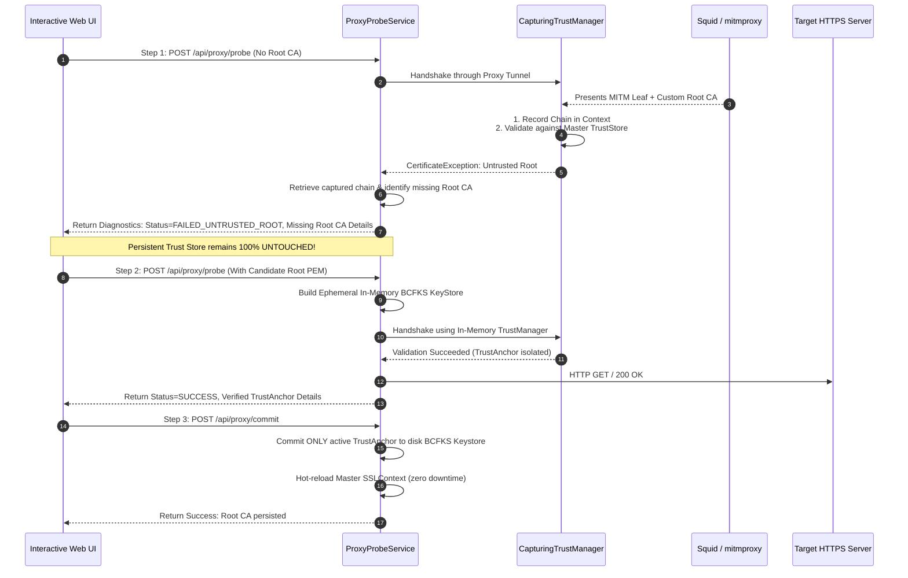

# BCFIPS Proxy Gateway with Capturing & In-Memory Trust Manager

A production-grade, educational Spring Boot application demonstrating:
1. **Capturing Trust Manager**: Intercepts TLS handshakes to extract raw peer certificate chains, analyze PKIX certification paths, diagnose missing Root/Intermediate CAs, and return actionable metadata rather than opaque handshake failures.
2. **In-Memory Trust Manager**: Creates ephemeral, isolated `BCFKS` (Bouncy Castle FIPS) KeyStores for provisional connection testing. Ensures the persistent master trust store remains **100% untouched** if a connection fails.
3. **Anchor Isolation**: Upon verified end-to-end success, extracts **only the active `TrustAnchor`** used by the validator (discarding intermediate or unverified certificates) and commits it to the persistent BCFKS keystore on disk.
4. **Proxy Matrix Support**:
   - HTTP Forward Proxy (No Auth)
   - HTTP Forward Proxy with Basic Authentication
   - HTTPS Forward Proxy (Direct TLS to proxy)
   - TLS Inspection / MITM Proxies (Squid SSL Bump, mitmproxy)
5. **Interactive UI/UX**: Single-page discovery wizard with real-time certificate hierarchy visualizer, candidate Root CA editor, one-click commit, and live step-by-step diagnostic log stream.
6. **Container-Based Test Harness**: Ready-to-run Docker Compose stack (Squid plain, Squid with Auth, and mitmproxy inspection) and Testcontainers integration tests.

---

## 🏛️ Architecture & Core Concepts

### 1. What is a Capturing Trust Manager?
In standard JSSE (`javax.net.ssl.X509TrustManager`), when a remote server or inspection proxy presents an untrusted certificate chain, the trust manager throws an immediate `CertificateException`. JSSE abruptly tears down the connection and **discards the peer certificate chain**. The caller only receives a generic error:
> `PKIX path building failed: unable to find valid certification path to requested target`

Our **`CapturingTrustManager`** decorates `X509ExtendedTrustManager`:
- Intercepts `checkServerTrusted(X509Certificate[] chain, String authType, Socket/SSLEngine)`.
- Records the complete presented chain (Leaf $\rightarrow$ Intermediate(s) $\rightarrow$ Root) into a `ThreadLocal` context (`HandshakeCaptureContext`).
- Generates verbose, educational logs for each certificate (Subject DN, Issuer DN, Serial Number, SHA-256 Fingerprint, Self-Signed status).
- If validation fails, analyzes whether the topmost certificate is a presented self-signed Root CA or an intermediate certificate issued by an external unknown Root CA.
- Exposes this diagnostic information so the user and UI know **precisely which Root CA must be provided**.



---

### 2. What is an In-Memory Trust Manager?
Modifying persistent keystores on disk during connection testing is hazardous:
- Unverified, malicious, or incorrect certificates could be permanently trusted.
- Multi-user concurrency issues.
- Corrupted trust stores prevent future legitimate connections.

The **`InMemoryTrustStoreManager`**:
- Clones current master trust anchors into a transient, in-memory `KeyStore` (type `BCFKS`).
- Injects candidate Root CAs provided by the user in Step 2 under temporary aliases.
- Executes the probe against an isolated `SSLContext` powered by BCFIPS.
- If the probe fails, the in-memory store is simply garbage-collected. The persistent file is completely unaffected.

---

### 3. FIPS 140-3 Mode with BCFIPS (`bc-fips` & `bctls-fips`)
Configured in `BcfipsSecurityConfig`:
- **`BouncyCastleFipsProvider`** installed at security position 1.
- **`BouncyCastleJsseProvider` (BCJSSE)** installed at position 2.
- Keystores use the **`BCFKS`** format (Bouncy Castle FIPS KeyStore), protecting certificate integrity with HMAC, PBKDF2, and AES.
- Cryptographic self-tests and approved-mode algorithms (RSA $\ge$ 2048-bit, SHA-256+, ECDHE key exchange).

---

## 🚀 Running the Application

### Prerequisites
- **Java 21**
- **Maven 3.9+**
- **Docker** (for the container test harness)

### 1. Build and Run Unit/Integration Tests
```bash
mvn clean test
```
*Note: Includes full in-process mock proxy tests simulating plain, authenticated, and MITM inspection proxies.*

### 2. Start the Spring Boot Application
```bash
mvn spring-boot:run
```
Once started, access the interactive Web UI at:
👉 **`http://localhost:8080/`**

---

## 🐳 Container-Based Test Harness

The `test-harness/` directory provides a pre-configured Docker Compose stack with 3 proxy types:

| Container | Type | Port | Authentication | TLS Inspection |
| :--- | :--- | :--- | :--- | :--- |
| **`proxy-squid-plain`** | HTTP Forward Proxy | `3128` | None | No |
| **`proxy-squid-auth`** | HTTP Forward Proxy | `3129` | Basic (`testuser` / `testpass`) | No |
| **`proxy-mitmproxy`** | HTTPS Inspection Proxy | `8888` (proxy)<br>`8889` (UI) | None | **Yes** (Custom CA) |

### Starting the Harness
```bash
cd test-harness
docker compose up -d
```

### Inspecting mitmproxy Inspection CA
mitmproxy automatically generates its inspection CA in `test-harness/mitmproxy/certs/mitmproxy-ca-cert.pem`.
You can view this certificate:
```bash
cat test-harness/mitmproxy/certs/mitmproxy-ca-cert.pem
```

---

## 🧪 Interactive Step-by-Step UI Walkthrough

1. Open **`http://localhost:8080/`** in your browser.
2. Click the preset button: **`[MITM Inspection (Port 8888)]`**.
3. **Step 1 (Probe)**: Click **"Step 1: Probe Connection"**:
   - The probe attempts connection through the inspection proxy.
   - mitmproxy intercepts TLS and re-signs with its own CA.
   - The UI displays:
     - ⚠️ **"TLS Handshake Failed: Untrusted Certificate"**
     - Visual tree of the captured certificate chain (Leaf $\rightarrow$ MITM Root CA).
     - Missing Root CA details (Subject DN, Issuer DN, SHA-256 Fingerprint).
     - Confirmation that the **persistent trust store was untouched**.
4. **Step 2 (Verify in Memory)**:
   - Click **"Use Presented CA PEM"** (or paste `mitmproxy-ca-cert.pem`).
   - Click **"Step 2: Verify in Ephemeral In-Memory Store"**.
   - Ephemeral SSLContext connects and validates HTTP 200 OK.
   - The UI turns green: **"Connection Established (HTTP 200)"**.
   - Notice the **"Step 3: Commit Verified Root CA"** button is now unlocked!
5. **Step 3 (Commit)**:
   - Click **"Step 3: Commit Verified Root CA to BCFKS Store"**.
   - The Root CA is persisted into `./data/application-truststore.bcfks`.
   - The master SSLContext hot-reloads instantly.
   - Switch to the **"Persistent TrustStore"** tab to see your active committed root anchor!
6. Click **"Step 1: Probe Connection"** again: it now succeeds permanently!

---

## 📡 REST API Reference

### 1. Probe Proxy Connection
`POST /api/proxy/probe`
```json
{
  "targetUrl": "https://httpbin.org/get",
  "proxy": {
    "host": "127.0.0.1",
    "port": 8080,
    "protocol": "HTTP",
    "username": null,
    "password": null
  },
  "candidateRootPem": null
}
```

### 2. Commit Root CA
`POST /api/proxy/commit`
```json
{
  "rootPem": "-----BEGIN CERTIFICATE-----\n...\n-----END CERTIFICATE-----",
  "alias": "mitm-root-ca"
}
```

### 3. List Committed Trust Anchors
`GET /api/truststore`

### 4. Delete Trust Anchor
`DELETE /api/truststore/{alias}`
